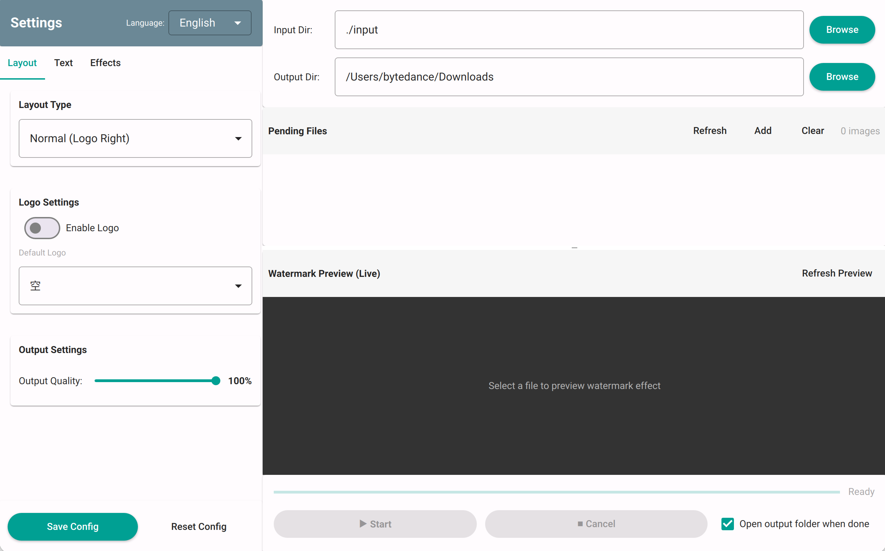

# semi-utils
[中文](README.md)

> **A tool for batch adding watermarks to photos, processing photo aspect ratios, image colors, and quality.**

Thanks to the original developer [leslievan](https://github.com/leslievan/semi-utils). This project adds a GUI based on the original work.

## Preview

||||
|-|-|-|
||||
||||
||||


## Usage

> **Quick Steps**
>
> 

### Windows

- Click [Release](https://github.com/Gaojianli/semi-utils-gui/releases) to download the zip package directly, which contains the executable `main.exe`, configuration file `config.yaml`, input folder `input`, and output folder `output`.
- Extract the zip package, for example to `D:\semi-utils`
- Double-click `D:\semi-utils\main.exe` to run the program

---

### macOS/Linux

#### Using git

- **Install required dependencies (run once before first use)**

  Open terminal and enter:

  ```shell
  # Use git to clone the code locally, e.g., ~/semi-utils. Replace the path in the command if you want to download to a different location
  git clone --depth 1 https://github.com/Gaojianli/semi-utils-gui.git ~/semi-utils
  cd ~/semi-utils
  chmod +x install.sh
  ./install.sh
  ```

  > You can press Command+Space to open Spotlight search, then type `Terminal`.
  >
  > If the command fails, refer to [FAQ](#faq).

- Copy the images you want to watermark to the `~/semi-utils/input` folder

- Open terminal and enter:

   ```shell
   cd ~/semi-utils
   python3 ~/semi-utils/main.py
   ```

- Follow the GUI instructions

## Configuration

Configure via `config.yaml`.

<details>
<summary>Click to expand</summary>

```yaml
base:
  alternative_bold_font: ./fonts/Roboto-Medium.ttf
  alternative_font: ./fonts/Roboto-Regular.ttf
  # Bold font
  bold_font: ./fonts/AlibabaPuHuiTi-2-85-Bold.otf
  # Bold font size
  bold_font_size: 1
  # Regular font
  font: ./fonts/AlibabaPuHuiTi-2-45-Light.otf
  # Regular font size
  font_size: 1
  # Input folder
  input_dir: ./input
  # Output folder
  output_dir: ./output
  # Output image quality. If you find the output image size too large (e.g., a 20MB image becomes 40MB after processing), you can reduce the quality to decrease file size
  quality: 100
global: # Global settings, you can modify these through [More Settings] in the command line
  focal_length:
    # Whether to use equivalent focal length
    use_equivalent_focal_length: false
  padding_with_original_ratio:
    # Whether to use the original image aspect ratio for white border padding
    enable: false
  shadow:
    # Whether to enable shadow
    enable: false
  white_margin:
    # Whether to enable white border
    enable: true
    # White border width
    width: 3
layout:
  # Background color, only effective when layout is normal (custom)
  background_color: '#ffffff'
  elements:
    # Bottom left element
    left_bottom:
      # Bottom left text color, only effective when layout is normal (custom)
      color: '#757575'
      # Whether to use bold, only effective when layout is normal (custom)
      is_bold: false
      # Bottom left text content, see options in the table below
      name: Model
    # The following three elements have similar settings
    left_top:
      color: '#212121'
      is_bold: true
      name: LensModel
    right_bottom:
      color: '#757575'
      is_bold: false
      name: Datetime
      value: Photo by NONE
    right_top:
      color: '#212121'
      is_bold: true
      name: Param
  # Whether to use Logo, only effective when layout is normal (custom), options are true, false
  logo_enable: false
  # Logo position, only effective when layout is normal (custom), options are left, right
  logo_position: left
  # Layout type, see options in the table below, you can modify it through [Layout] in the command line
  type: watermark_right_logo
logo:
  makes:
    canon: # Identifier, user-defined, must be unique
      id: Canon # Manufacturer name, obtained from exif info, must match the Make field in exif info
      path: ./logos/canon.png # Logo path
    # Same below
    fujifilm:
      id: FUJIFILM
      path: ./logos/fujifilm.png
    hasselblad:
      id: HASSELBLAD
      path: ./logos/hasselblad.png
    huawei:
      id: HUAWEI
      path: ./logos/xmage.jpg
    leica:
      id: leica
      path: ./logos/leica_logo.png
    nikon:
      id: NIKON
      path: ./logos/nikon.png
    olympus:
      id: Olympus
      path: ./logos/olympus_blue_gold.png
    panasonic:
      id: Panasonic
      path: ./logos/panasonic.png
    pentax:
      id: PENTAX
      path: ./logos/pentax.png
    ricoh:
      id: RICOH
      path: ./logos/ricoh.png
    sony:
      id: SONY
      path: ./logos/sony.png

```

### Layout.Element.Name Options

| Option                  | Description                              |
|-------------------------|------------------------------------------|
| Model                   | Camera model (e.g., Nikon Z7)            |
| Make                    | Camera manufacturer (e.g., Nikon)        |
| LensModel               | Lens model (e.g., Nikkor 24-70 f/2.8)    |
| Param                   | Shooting parameters (e.g., 50mm f/1.8 1/1000s ISO 100) |
| Datetime                | Shooting datetime (e.g., 2023-01-01 12:00) |
| Date                    | Shooting date (e.g., 2023-01-01)         |
| Custom                  | Custom                                   |
| None                    | None                                     |
| LensMake_LensModel      | Lens manufacturer + Lens model (e.g., Nikon Nikkor 24-70 f/2.8) |
| CameraModel_LensModel   | Camera model + Lens model (e.g., Nikon Z7 Nikkor 24-70 f/2.8) |
| TotalPixel              | Total pixels (MP)                        |
| CameraMake_CameraModel  | Camera manufacturer + Camera model (e.g., DJI FC123) |

### Layout.Type Options

| Option                              | Description                    | Preview                           |
|-------------------------------------|--------------------------------|-----------------------------------|
|watermark_left_logo|Normal||
|watermark_right_logo|Normal (Logo Right)||
|dark_watermark_left_logo|Normal (Dark)||
|dark_watermark_right_logo|Normal (Dark, Logo Right)||
|custom_watermark|Normal (Custom)||
|square|1:1 Square||
|simple|Simple||
|background_blur|Background Blur||
|background_blur_with_white_border|Background Blur + White Border||

</details>

## FAQ

### `command not found` when running `pip install`

**This is likely because Python3 is not installed.** You can install Python3 using one of the following methods:

1. Install using Homebrew.

   Homebrew is a package manager for Mac that makes it easy to install many applications and services.

   - If you already have `brew` installed, open terminal and enter the following command to install Python3:

     ```shell
     brew install python3
     ```

     If this command shows `command not found`, it means you don't have `brew` installed. Go to the next step.

    - If you don't have `brew` installed, open terminal and enter the following command to install Homebrew:

      ```shell
      /bin/bash -c "$(curl -fsSL https://raw.githubusercontent.com/Homebrew/install/HEAD/install.sh)"
      ```

      Then enter the following command to install Python3:

      ```shell
      brew install python3
      ```

2. Install using dmg package

   You can download the Python3 installer from the [Python official website](https://www.python.org/downloads/macos/). Choose any version under Stable Release, `3.10.11` is recommended. Then open the downloaded installer and follow the prompts to install.

**Verify Installation**

After installation, you can use the following command to verify that Python3 is correctly installed:

```shell
python3 --version
```

This command will return the installed Python3 version number.

## Special Thanks

[Claude](https://claude.com/product/claude-code) for helping to create the gui.


## License

Semi-Utils is released under the [Apache License 2.0](LICENSE).

Semi-Utils uses [exiftool](https://exiftool.org/), which is released under [GPL v1 + Artistic License 2.0](https://exiftool.org/#license).

## About

[](https://starchart.cc/Gaojianli/semi-utils-gui)
